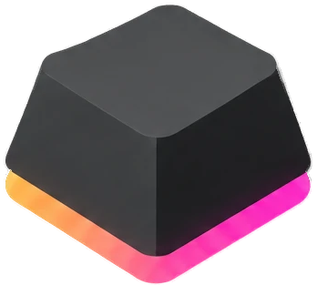

<div align="center">
  

  # OpenRGB-WIN68

  **AULA WIN 68 HE per-key RGB control for OpenRGB 1.0**

  [](https://openrgb.org/)
  [](https://openrgb.org/)
  [](#installation)
  [](#building-from-source)

  
</div>

---

## Video demo

[](https://www.youtube.com/watch?v=YOUR_YOUTUBE_VIDEO_ID)

> Replace `YOUR_YOUTUBE_VIDEO_ID` with the published demo's YouTube video ID. Until then, the preview image is only a placeholder.

## Overview

OpenRGB-WIN68 is a Windows x64 OpenRGB plugin for the **AULA WIN 68 HE** keyboard. It exposes the keyboard as a virtual OpenRGB controller, with 68 named per-key LEDs, a native 5 × 16 matrix, firmware lighting modes, and direct per-key color control. The plugin also provides a clickable keyboard preview in its Settings page.

The implementation targets **OpenRGB 1.0 / Plugin API 5** and communicates with the keyboard through its vendor HID interface. The 68-key mapping is based on the vendor WIN68 layout and Aether-HE protocol research. Some protocol/layout details remain provisional; see [Hardware & protocol specifications](#hardware--protocol-specifications) and [Troubleshooting](#troubleshooting).

> **Important safety note:** Very frequent Custom/per-key animation writes have been observed to coincide with missed or temporarily stuck key presses on this keyboard. The exact cause is unconfirmed, and no safe continuous high-rate setting has been established. Stop the effect immediately if keyboard input behaves incorrectly. See [Audio sync & benchmarking](#audio-sync--benchmarking).

## Features

- **68 individually named keys** exposed to OpenRGB and SDK clients.
- **Direct per-key lighting** and a separate Custom (per-key palette) mode.
- **Firmware effects**, including Static, Breath, Wave, Neon, Radar, Reactive, Aurora, Ripple, Twinkle, Cross, Speed Respond, Auto Ripple, Striation, and Fireworks.
- **Settings-page keyboard preview:** click a labeled key to select its color; the preview follows the controller state.
- **OpenRGB Devices matrix:** 5 rows × 16 columns, with standardized key names for supported wide-key expansion.
- **OpenRGB SDK support:** single-key, zone, and batched color updates use the same controller.
- **Examples and diagnostics:** Python SDK sync and rain benchmark, optional stereo WASAPI audio sync, endpoint peak probe, and keymap/layout validation.
- **Reduced redundant HID traffic:** identical lighting reports and unchanged palette pages are cached. This does not cap animation FPS.

## Installation

### Download a prebuilt plugin

1. Close Aether and any AULA/vendor keyboard software that may be controlling the keyboard. Only one application should own the vendor HID interface at a time.
2. Open the repository's **Actions** tab and run **Build AULA WIN68 HE plugin**, or download its latest successful artifact:
   `OpenRGBAulaHE-0.7.0-OpenRGB-1.0-windows-x64`.
3. Extract the artifact. Copy `OpenRGBAulaHE.dll` into the OpenRGB `plugins` folder. Copy `hidapi-hotplug.dll` only if needed; **do not overwrite a newer copy** already supplied with OpenRGB.
4. Start or restart OpenRGB 1.0, enable the plugin, and confirm that **AULA WIN 68 HE** appears as a device.
5. Select **Direct** for per-key color control, or choose one of the firmware effects. The plugin's labeled key picker is available in OpenRGB's Settings/plugin page.

To use Python SDK examples, enable **Settings → SDK Server** in the same OpenRGB process that loaded this plugin. In that server instance, enable **All Controllers** so plugin-created controllers are visible to SDK clients. If using OpenRGB Effects, select the WIN68's Direct-capable zone.

### Compatibility

- OpenRGB **1.0**, Plugin API **5**
- Windows **x64**
- AULA **WIN 68 HE** (and compatible identity strings listed below)
- Build toolchain: **Qt 6.8.3 for MSVC 2022 x64** and the matching OpenRGB 1.0 source/headers

Other AULA boards can share the same USB VID:PID. The plugin checks product strings to avoid assigning the WIN68 keymap to unrelated devices; compatible aliases are listed in the table below.

## Hardware & protocol specifications

| Item | Value / behavior |
| --- | --- |
| Device | AULA WIN 68 HE RGB keyboard |
| USB VID:PID | `2E3C:C365` (shared by other AULA devices; not sufficient by itself to identify a WIN68) |
| HID usage page | `0xFF1B` vendor interface |
| Accepted product strings | `WIN 68`, `SI2828HEARGB`, `SI2828KZHEARGB` (product-string match is used with the vendor usage page) |
| OpenRGB controller | `AULA WIN 68 HE` virtual keyboard controller |
| Logical LEDs | 68 named keys; firmware indices occupy a 132-slot table |
| OpenRGB matrix | 5 × 16; wide-key display depends on OpenRGB's standardized key expansion |
| HID report | 64-byte reports, report ID `0x01` |
| Lighting command | Command `0x07`; firmware mode, brightness, speed, foreground/background RGB, direction, full-color flag, and power fields |
| Custom palette command | Command `0x09`; RGB palette is sent in eight pages (396-byte table, up to 54 data bytes per report); unchanged pages are skipped |
| Custom palette storage | The `0x09` palette targets a persistent Custom1 slot; volatile live-stream behavior has not been independently verified |
| Mode/brightness/speed | Firmware modes use codes listed below; brightness and speed values are clamped to `0–4` |

| OpenRGB mode | Firmware code | Notes |
| --- | ---: | --- |
| Direct | `10` | Per-key output path |
| Static | `0` | Firmware effect |
| Breath | `1` | Speed control |
| Wave | `2` | Speed and direction controls |
| Neon | `3` | Speed control |
| Radar | `4` | Speed and left/right direction |
| Reactive | `6` | Speed control |
| Aurora | `7` | Speed and vertical/horizontal direction |
| Ripple | `8` | Speed control |
| Twinkle | `9` | Speed control |
| Custom (per-key palette) | `10` | Writes the persistent per-key palette |
| Cross | `11` | Speed control |
| Speed Respond | `12` | Direction control |
| Auto Ripple | `14` | Speed control |
| Striation | `15` | Speed and left/right direction |
| Fireworks / Frenzy alias | `16` | Two OpenRGB names for the same firmware mode |

> **Protocol status:** Commands and mode mappings are based on Aether-HE research and the available vendor layout; they are not a complete vendor protocol specification. The WIN68 key indices are marked provisional in the source layout and have not been physically verified key-by-key on every supported unit. Confirm behavior on your own hardware before relying on it.

## Audio sync & benchmarking

### OpenRGB Effects audio visualizer

The OpenRGB Effects plugin captures audio from a Windows playback endpoint's **(Loopback)** entry. Select the endpoint that is actually playing sound (for example, the Bluetooth device if that is where your headphones are connected), then choose the Audio Visualizer and the WIN68 Direct-capable zone. A microphone/input endpoint captures microphone audio instead of playback. Switching the Windows default output may not automatically update the endpoint selected in Effects.

If the Effects preview is flat, try the included read-only audio probe from PowerShell (Windows; run from the repository root):

```powershell
python -m pip install -r requirements-audio.txt
python scripts/audio_probe.py --seconds 5
python scripts/audio_probe.py --seconds 2 --test-tone
python scripts/audio_probe.py --seconds 2 --check-effects --verify-loopback
```

The probe reads peak levels and does not record or save audio. The optional test tone plays briefly through the default output. If independent stereo loopback has nonzero peaks but Effects initialization fails (for example, `0x88890008`), that indicates an Effects/WASAPI format initialization issue, not a WIN68 lighting issue. Check whether the playback device offers a supported stereo default format, then restart OpenRGB and test again. Device-driver options vary.

### Python SDK audio sync

The optional `examples/audio_sync.py` script uses independent stereo WASAPI loopback, analyzes 16 frequency bands, and sends colors to SDK-visible Direct-capable devices. It restores the previous mode/colors on exit. Install both requirement sets and first run a bounded dry run:

```powershell
python -m pip install -r requirements.txt -r requirements-audio.txt
python examples/audio_sync.py --list
python examples/audio_sync.py --seconds 10 --dry-run
python examples/audio_sync.py --seconds 10 --fps 10
```

The WIN68 is **opt-in** because rapid writes to its persistent palette may affect typing or storage endurance. To include it, use `--include-aula` only after considering the hardware warning; there is no known validated safe long-term update rate. If `--list` does not show the keyboard, use the SDK server in the OpenRGB process that displays it, enable **All Controllers**, and pass that server's port with `--port` if it is not the default.

### Benchmarking

`examples/rain_benchmark.py` measures SDK update latency and frame rate. By default it animates SDK-visible Direct-capable devices **except the WIN68**. Use `--dry-run` first; the keyboard requires an explicit `--include-aula` opt-in:

```powershell
python -m pip install -r requirements.txt
python examples/rain_benchmark.py --list
python examples/rain_benchmark.py --dry-run --seconds 5
python examples/rain_benchmark.py --seconds 10 --fps 10
python examples/rain_benchmark.py --seconds 10 --fps 10 --include-aula
```

Reports are written under `reports/` and include frame counts, measured rate, mean/95th-percentile SDK latency, and errors per device. Successful SDK writes do not prove that every frame was physically displayed. Stop competing lighting effects before benchmarking. AULA opt-in runs can write the persistent palette frequently and may interfere with typing; use at your own discretion.

## Troubleshooting

| Symptom | Suggested checks |
| --- | --- |
| Plugin/device does not appear | Confirm OpenRGB 1.0 and Windows x64; enable the plugin; reconnect the keyboard; close Aether/vendor software; reload the plugin. Check that the device's product string matches a supported WIN68 identity. |
| Another AULA device is detected incorrectly | VID:PID `2E3C:C365` is shared. The plugin requires the vendor usage page and checks the product string; unknown strings are intentionally not treated as a WIN68. |
| LEDs do not change / HID write errors | Close all other software using the keyboard, reconnect it, reload the plugin, and try a firmware mode before testing per-key colors. Check the plugin status for report/error counts. |
| Some keys are misplaced or named incorrectly | The vendor-derived 68-key mapping is provisional. Run `./scripts/validate.ps1` in PowerShell to validate generated mapping/matrix consistency; validation does not replace a physical key-by-key test. Report the affected key and firmware index. |
| Effects SDK does not list the WIN68 | Run the SDK server in the same OpenRGB process where the plugin is loaded and the device is visible. Enable **All Controllers** in that server process; verify with `python examples/rain_benchmark.py --list`. |
| SDK connects to a different OpenRGB instance | Specify that instance's port with `--port`. A separate OpenRGB process cannot publish the GUI process's locally created controller. |
| Audio visualizer is silent | Select the active playback device's `(Loopback)` endpoint, not a microphone or a different output. Run `scripts/audio_probe.py` to distinguish capture from lighting problems. |
| Keyboard misses or holds key presses during an effect | Stop the effect immediately; reconnect the keyboard if necessary. High-rate Custom/per-key writes are a known observed hazard. The plugin does not silently throttle the requested FPS. |
| OpenRGB key matrix widths look uneven | OpenRGB's device matrix supports standardized wide-key expansion, not arbitrary pixel-accurate widths. Leave **Disable Key Expansion** unchecked. The Settings-page preview uses vendor key widths. |

## Building from source

### Automated build (recommended)

Push the source to GitHub, then run **Build AULA WIN68 HE plugin** from the repository's Actions tab. The workflow checks the generated keymap and 5 × 16 matrix, obtains OpenRGB's `release_1.0` source, installs Qt 6.8.3 for MSVC 2022 x64, builds the plugin, and uploads the DLL plus the matching HID library as an artifact.

### Local Windows build

Use an **x64 Visual Studio 2022 Developer PowerShell** with MSVC tools and Qt 6 `qmake.exe` available on `PATH`. Provide a matching OpenRGB 1.0 source tree containing `OpenRGBPluginInterface.h`:

```powershell
python scripts/generate_keymap.py --check
python scripts/check_layout.py
./scripts/build-plugin.ps1 -OpenRGBSource .\vendor\openrgb-1.0 -OutputDirectory .\dist
```

The build script emits `OpenRGBAulaHE.dll` under the output directory. The local OpenRGB source tree is not included; obtain the matching OpenRGB release source separately. A successful compile is not a substitute for testing with the target keyboard and OpenRGB version.

### Python tools

Core SDK examples require Python 3.9+ and `openrgb-python` 0.3.x (`requirements.txt`). Audio tools are Windows-specific and additionally use `pycaw`, `pyaudiowpatch`, and NumPy (`requirements-audio.txt`). In Windows PowerShell, prefer `python -m pip ...` to ensure packages are installed into the interpreter used to run the scripts.

## Repository structure

```text
.
├── assets/
│   ├── icon.png                 # Project icon
│   └── logo.png                 # Project logo
├── plugin/                      # OpenRGB plugin and HID device implementation
├── layout/                      # Vendor-derived WIN68 key layout
├── examples/
│   ├── audio_sync.py            # Optional stereo loopback SDK sync
│   ├── python-sync.py           # Basic Python SDK color synchronization
│   ├── rain_benchmark.py        # SDK latency/frame-rate benchmark
│   └── win68-led-layout.json    # LED layout data
├── scripts/
│   ├── build-plugin.ps1         # Local MSVC/Qt build
│   ├── check_layout.py          # 68-key and matrix validation
│   ├── generate_keymap.py       # Generate/check embedded key map
│   ├── audio_probe.py           # Read-only Windows audio diagnostics
│   ├── probe_modes.py           # Read-only HID mode probe
│   └── validate.ps1             # Validation entry point
├── .github/workflows/           # Windows x64 CI build workflow
├── requirements.txt             # Core Python SDK dependency
├── requirements-audio.txt       # Optional audio dependencies
├── INSTALL-fa.md                # Persian installation notes
└── README.md
```

## License

No `LICENSE` file or explicit license terms are currently included in the project source. Until the project owner publishes a license, all rights remain with the respective copyright holders; do not assume that the code is open source or that redistribution, modification, or commercial use is permitted. Add a license file before distributing or reusing this project.
