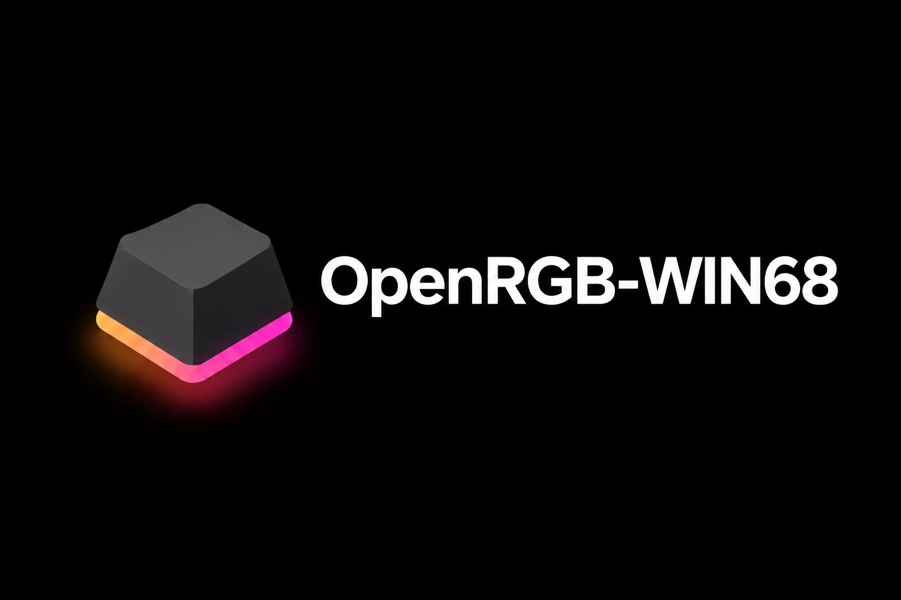

<div align="center">

  

  # OpenRGB-WIN68

  **OpenRGB Plugin & Controller for Aula WIN68 HE Mechanical Keyboard**

  [](LICENSE)
  [](https://openrgb.org)
  []()
  [](INSTALL-fa.md)

  [English](#overview) • [راهنمای فارسی](INSTALL-fa.md) • [Features](#features) • [Installation](#installation) • [Video Demo](#video-demo)

</div>

---

## 📹 Video Demo

Click the image below to watch the plugin in action on YouTube:

<div align="center">

[](https://www.youtube.com/watch?v=YOUR_YOUTUBE_VIDEO_ID)

</div>

---

## 📌 Overview

**OpenRGB-WIN68** is a native OpenRGB plugin (API v5) that adds full RGB and lighting mode integration for the **Aula WIN68 HE** magnetic switch keyboard.

It bridges the keyboard's vendor protocol with OpenRGB, giving you individual per-key LED addressing, native wide-key rendering, and compatibility with the OpenRGB Effects Plugin (including Audio Visualizer).

---

## ✨ Features

- **68 Individually Addressable LEDs:** Full `Direct` and `Custom (per-key palette)` lighting support.
- **Accurate Matrix & Physical Layout:** Visualizes the genuine 68-key form factor in Settings with precise key widths.
- **OpenRGB Native UI Support:** Exposes standard `Key:` names and a 5×16 matrix for built-in key expansion (Tab, Caps, Shift, Enter, Space).
- **Effects Plugin & Audio Sync:** Works with the OpenRGB Effects plugin and WASAPI loopback audio reactive modes.
- **OpenRGB SDK Server Support:** Addressable via Python scripts and third-party SDK integrations.
- **Hardware-Friendly:** Smart palette change caching to minimize HID traffic.

---

## 📥 Installation

### Prerequisites
- **OpenRGB 1.0** (Windows x64 build)
- Aula WIN68 HE connected via USB (Close vendor software/Aether before launching OpenRGB).

### Steps
1. Download the latest release `.dll` from the [Releases](https://github.com/BARDIA156/OpenRGB-WIN68/releases) page.
2. Place `OpenRGBAulaHE.dll` (and `hidapi-hotplug.dll` if not present) into your OpenRGB plugins directory:
```text
   %APPDATA%\OpenRGB\plugins\
   
